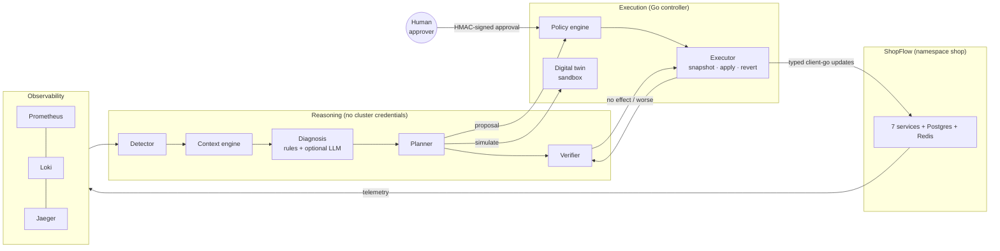

# AegisOps

**An autonomous reliability and security control plane for Kubernetes, with bounded autonomy.**

AegisOps watches a microservice application, detects incidents from SLO violations,
investigates them across metrics, logs, traces, Kubernetes state and change history, and
diagnoses the root cause with evidence and a calibrated confidence. It then proposes
remediations and tests risky ones in an isolated digital twin. A deterministic policy engine
decides what may run and when a human must approve. Actions execute through a Go controller,
recovery is verified against SLOs, interventions that do not help are rolled back, and every
incident ends with a postmortem that separates facts from hypotheses.

It ships with **ShopFlow**, a realistic seven-service shop with PostgreSQL, Redis, OpenTelemetry
traces, structured logs and Prometheus metrics. It also ships **21 reproducible failure
scenarios** and a benchmark that scores the system against ground truth it never sees.



## What happens during an incident

Recorded in the live environment for the flagship scenario, in which a payment release
enables a rounding mode that fails about 35% of charges:

| t (from injection) | Stage | What AegisOps did |
|---|---|---|
| 0s | Fault | `payment-service` 1.0.0 → 1.1.0 is rolled out (`PAYMENT_ROUNDING_MODE=bankers-v2`) |
| 35s | **Detect** | 5xx on payment 15.5%, order 22%, gateway 6.4% (each persisted for 2 cycles) → SEV1 incident |
| 36s | **Investigate** | 39 evidence items: metric series, clustered error logs, trace blame (53/56 failing traces originate in payment), the deployment diff 31s before onset, pod events, topology |
| 36s | **Diagnose** | BAD_DEPLOYMENT on payment-service, 95% confidence, citing 4 evidence ids; order/gateway/storefront identified as victims |
| 36s | **Plan** | `rollback_deployment` to revision 12, pinned to current revision 13; policy dry run: MEDIUM risk |
| 36–90s | **Simulate** | Current and rolled-back specs cloned into the sandbox under identical load: error rate 35.1% → 0.0% (Improved) |
| 90s | **Authorize** | Policy auto-approves MEDIUM *only because* the simulation improved, confidence ≥ 70%, and the circuit breaker is closed |
| 90–104s | **Execute** | Snapshot taken, rollback applied, rollout complete in 14s |
| 104–150s | **Verify** | Four consecutive healthy detector cycles: SLO violation score 12.10 → 0.00. RESOLVED |
| 150–210s | **Watch** | 60s recurrence watch, then a postmortem with FACT / HYPOTHESIS / MODEL INTERPRETATION labels |

If verification had shown no improvement, the controller would have restored the snapshot and
the engine would have planned a different remedy (up to 3 rounds), or escalated to a human
with the reason.

## Highlights

- **Deterministic safety core.** A pure-function policy engine in Go covers the action
  registry and prohibited classes, namespace allowlist, modes, protected workloads, limits,
  budgets, cooldowns, in-flight locks, a circuit breaker, simulation gating, risk scoring and
  **stale-plan preconditions**. It is re-checked after approval, at execution time.
- **Models propose, policy decides.** LLMs are optional (OpenAI, Gemini, Groq, NVIDIA, Ollama
  behind one router with retries, timeouts, fallback, structured output, validation and cost
  accounting). Model output must cite existing evidence and use only registry actions, and its
  weight in the diagnosis is bounded. With no API keys, everything runs on the deterministic
  path.
- **Cryptographic human approval.** The API signs the exact action spec hash with HMAC. The
  controller verifies freshness and signature, and the spec is immutable. The engine can
  neither approve nor sign.
- **Digital twin.** Candidate fixes run against clones with stripped secrets, local data
  stores and identical synthetic load in an isolated namespace. Isolation is enforced by
  network policy, and was verified empirically.
- **Closed loop with rollback.** SLO-based verification, automatic revert on no effect or
  degradation, a recurrence watch, and bounded rounds.
- **Evidence you can audit.** Every evidence item keeps its source query and time window.
  Postmortems label each claim. The audit log is hash-chained and append-only.
- **Progressive delivery.** `CanaryRelease` runs replica-ratio canaries with an automated SLO
  gate and abort.
- **Honest evaluation.** 21 scenarios with hidden ground truth, Wilson and bootstrap
  confidence intervals, reproducibility metadata, and offline replay for comparing model
  configurations.

## Stack

| Layer | Technology |
|---|---|
| Control plane | Go 1.26, controller-runtime 0.22, client-go 0.34, CRDs with CEL validation |
| Reasoning, API, CLI | Python 3.12, FastAPI, SQLAlchemy 2 (async), Alembic, pydantic, httpx, Typer |
| Storage and events | PostgreSQL 16 (JSONB, FTS, LISTEN/NOTIFY, triggers) |
| Dashboard | Next.js 15, React 19, Tailwind, SWR, Recharts, server-sent events |
| Observability | OpenTelemetry (SDK and Collector), Prometheus, Loki, Jaeger v2, Grafana |
| Environment | kind (Kubernetes 1.34), Kustomize, a one-command `devctl.py` |

## Quickstart

Requirements: Docker (4 CPUs and 8 GB for Docker), kind, kubectl, Python ≥ 3.10.

```bash
python scripts/devctl.py up
```

This creates the cluster, builds and loads images, generates secrets (git-ignored), deploys
everything, and prints URLs and demo credentials:

| | |
|---|---|
| Dashboard | http://localhost:3000 |
| API and OpenAPI | http://localhost:8000/docs |
| Grafana / Jaeger / Prometheus | http://localhost:3001 · http://localhost:16686 · http://localhost:9090 |
| ShopFlow storefront | http://localhost:8080 |

To add model-assisted reasoning, export for example `OPENAI_API_KEY` (and optionally
`AEGIS_LLM_ROUTES`, see `.env.example`) before `up`. Details are in
[docs/DEVELOPMENT.md](docs/DEVELOPMENT.md).

## Demo workflow

1. Open the dashboard and sign in as `approver` (password from
   `python scripts/devctl.py credentials`). All services are green.
2. **Demo scenarios → "Payment release with a ledger rounding regression" → Inject.**
3. Watch the Overview: the dependency map turns amber and red, and an incident appears within
   about 40s. Open it. The lifecycle rail advances live (SSE).
4. Read the **Diagnosis**. Click the cited evidence ids to see the deployment diff, the error
   series and the trace blame.
5. See **Sandbox simulation** (current vs. rolled back) and the **policy checks** behind the
   autonomous decision, then **Verification** (before/after SLO table).
6. Open the **Postmortem**.
7. For the human-in-the-loop path, inject **"Redis accidentally scaled to zero."** Redis is
   protected, so AegisOps asks for approval. The approval card shows risk, reasons, expected
   effect and rollback. Approve it, and the controller verifies the signed approval before
   scaling.
8. For escalation, inject **"Network latency between order-service and payment-service."**
   AegisOps diagnoses network degradation on the path, finds no safe automated remedy, and
   escalates with that reason.
9. **Automation & policy**: switch to `observe` and inject again. Every action is denied and
   visible as a risk event.

The same flow works from the CLI: `aegis scenario inject payment-bad-release`,
`aegis incidents --status active`, `aegis incident get <id>`, `aegis approvals`,
`aegis approve <action-id> --reason "..."`.

## Evaluation

The live benchmark runs every scenario end to end in the real environment. It resets and
waits for 60s of health, injects, lets AegisOps handle the incident, then scores it. The
method, metric definitions and threats to validity are in [docs/EVALUATION.md](docs/EVALUATION.md).

<!-- RESULTS -->

## Safety model in one table

| Question | Answer |
|---|---|
| Can a model run a command? | No. There is no shell, no `kubectl` and no exec anywhere. Only twelve typed actions exist (eleven remediations plus `revert_action`), and five destructive classes are registered as prohibited |
| Can the reasoning layer change the cluster? | Only by *requesting* an action. The controller decides, with its own RBAC |
| Who can approve? | Only a signed request from the API on behalf of an authenticated approver, bound to the exact spec |
| What stops a runaway loop? | Per-incident and global budgets, cooldowns, one in-flight action per target, no retry of failed actions, a circuit breaker, a round limit, and escalation on any internal error |
| What if the plan is stale? | The action carries the rollout revision it was planned against. Mismatches are denied at admission, at the post-approval recheck, and atomically at execution |
| What if telemetry lies? | Evidence is redacted, quoted and cross-checked. Detection needs persistence. Model output must be grounded |
| What if a dependency is down? | Fail closed on actions and degrade on reasoning. Gaps are recorded and confidence drops |

Full detail: [docs/SECURITY.md](docs/SECURITY.md) and [docs/THREAT_MODEL.md](docs/THREAT_MODEL.md).

## Documentation

| Document | Contents |
|---|---|
| [ARCHITECTURE.md](docs/ARCHITECTURE.md) | Components, loop and sequence diagrams, detection, evidence, diagnosis, planning, simulation, policy, verification, data model |
| [SECURITY.md](docs/SECURITY.md) | Identities, RBAC, approval signing, loop safety, isolation, untrusted input, secrets, known gaps |
| [THREAT_MODEL.md](docs/THREAT_MODEL.md) | Assets, trust boundaries, STRIDE per boundary, residual risks |
| [EVALUATION.md](docs/EVALUATION.md) | Benchmark method, metrics, statistics, reproduction, results |
| [INCIDENT_SCENARIOS.md](docs/INCIDENT_SCENARIOS.md) | The 21 scenarios with ground truth |
| [DESIGN_DECISIONS.md](docs/DESIGN_DECISIONS.md) | 16 decisions with alternatives and costs, including the ones forced by live testing |
| [API.md](docs/API.md) | REST and SSE reference, roles, control-plane API |
| [OPERATIONS.md](docs/OPERATIONS.md) | Modes, approvals, reading incidents, troubleshooting AegisOps itself |
| [DEVELOPMENT.md](docs/DEVELOPMENT.md) | Setup, tests, layout, extending actions, rules and scenarios |

## Limitations

This is a working system tested end to end in a local cluster. It is **not production-ready**.
The main reasons are listed here; the full list is in the linked documents.

- Single cluster, single managed namespace, single kind node. There is no HA for the
  controller API or the engine, and no multi-tenant isolation.
- Rules cover the failure mechanisms we wrote rules for. Novel mechanisms are diagnosed as
  UNKNOWN and escalated rather than fixed.
- The digital twin reproduces code and configuration faults. It cannot reproduce network
  faults, real traffic mix or data-dependent bugs, so it never *proves* safety.
- Model-assisted diagnosis is implemented and unit-tested with scripted providers. The
  reported live results use the deterministic path (no provider keys were configured).
- Security gaps: a symmetric approval key, no SSO/MFA, no per-token revocation, tamper-evident
  but not tamper-proof audit, and no image signing (see [SECURITY.md](docs/SECURITY.md#known-gaps-not-production-ready)).
- The sandbox ingress rules use kind's pod CIDR, and kind's CNI does not enforce egress
  policies (documented and compensated for).

## Roadmap

- Asymmetric approval signatures (KMS), OIDC login, and per-token revocation.
- Terraform modules for a managed-cluster deployment (EKS/GKE), with remote state and a
  CNI that enforces egress policies.
- Controller HA with leader election across replicas, and a TTL controller for action history.
- Learned calibration of rule weights from accumulated benchmark and production outcomes.
- Mesh-based traffic splitting for canaries, and traffic replay for the digital twin.
- A larger benchmark with repetitions, adversarial telemetry, and concurrent incidents.
