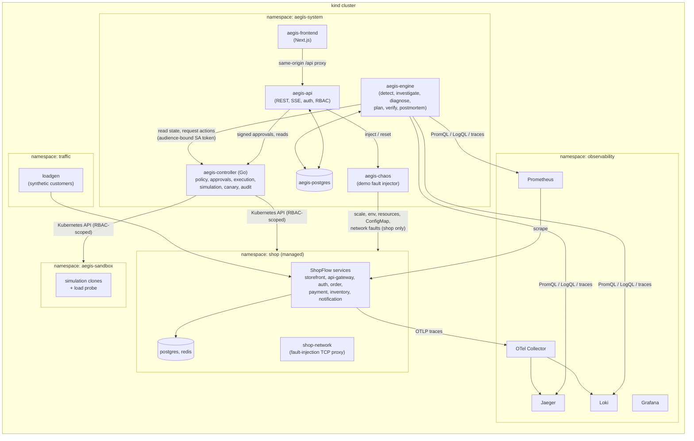
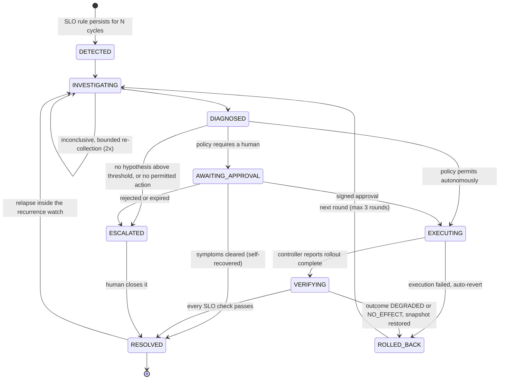
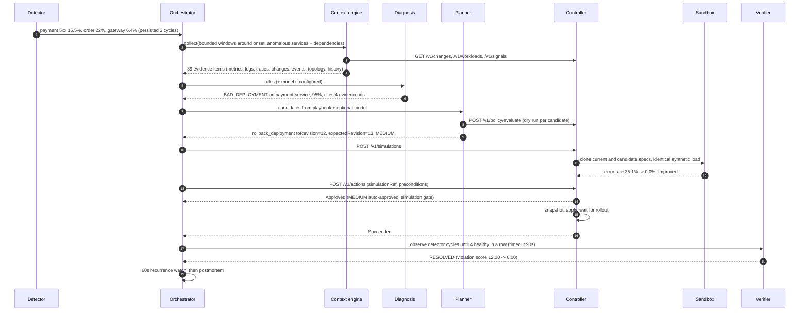
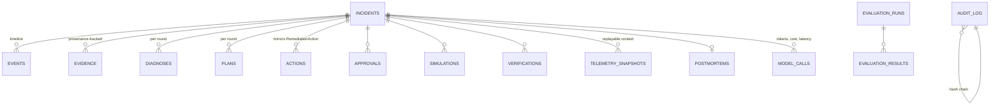

# Architecture

AegisOps is a closed-loop reliability control plane for a Kubernetes application. It observes
**ShopFlow** (a seven-service demo shop plus PostgreSQL and Redis), opens incidents from SLO
violations, investigates them, proposes remediations, and executes only what a deterministic
policy engine permits. It then verifies the outcome and rolls back interventions that made
things worse.

The design splits responsibilities along a trust boundary:

- **Reasoning** (Python, `aegis/`): detection, evidence collection, diagnosis, planning,
  verification, postmortems. It may use language models. It has **no Kubernetes credentials**.
- **Execution** (Go, `controlplane/`): a Kubernetes controller with a narrow HTTP API. It owns
  the action registry, the policy engine, approvals, snapshots, execution, simulation, canary
  analysis and reverts. It never calls a language model.

## System context



Users interact through the dashboard, the `aegis` CLI, or the REST API. All three go through
`aegis-api`, which authenticates users (JWT, four roles) and is the only holder of the approval
signing key.

## Components

| Component | Language | Responsibility | Kubernetes permissions |
|---|---|---|---|
| `aegis-controller` | Go (controller-runtime) | CRDs `RemediationAction`, `RemediationSimulation`, `CanaryRelease`, `AegisPolicy`; policy engine; approval verification; snapshots, execution, verification of rollout completion, automatic revert on failure; sandbox builder; canary analysis; change and event log; control-plane HTTP API; audit ring | Scoped Roles in `shop`, `aegis-system`, `aegis-sandbox`; ClusterRole only for `AegisPolicy` and `TokenReview` |
| `aegis-engine` | Python (asyncio) | Detector loop, incident lifecycle, context engine, diagnosis (rules plus optional model), planner, verifier, recurrence watch, postmortems, runbook sync, audit sync | **None**. Talks to the control-plane API with a projected, audience-bound token |
| `aegis-api` | Python (FastAPI) | Users, login, RBAC, REST, SSE stream, approval signing, demo proxy, evaluation records | **None** (same token mechanism, `approver` role on the control plane) |
| `aegis-frontend` | TypeScript (Next.js) | Operator dashboard; proxies `/api/*` to `aegis-api` same-origin | None |
| `aegis-chaos` | Python | Controlled fault injection and reset for the demo namespace only | Role in `shop` only |
| `aegis-postgres` | PostgreSQL 16 | Incidents, evidence, diagnoses, plans, actions, approvals, simulations, verifications, postmortems, append-only audit log, runbooks (FTS), evaluations, model-call accounting | n/a |
| ShopFlow | Python (FastAPI) | Realistic target: HTTP services with OTel traces, JSON logs, Prometheus RED metrics, client-side dependency metrics, DB pools, feature flags that reproduce real failure mechanisms | n/a |
| Observability | Prometheus, Loki, Jaeger v2, OTel Collector, Grafana | Metrics (pod annotations and cAdvisor), logs (filelog receiver to Loki), traces (OTLP with tail sampling) | Prometheus: read pods/nodes |

## The incident loop



A single round for the flagship scenario (a bad payment release), as recorded in the live
environment:



### Detection (`engine/detector.py`)

Every 5 seconds the detector evaluates, per service: request rate, 5xx ratio and p95 latency
(30-second PromQL windows), CPU and memory utilisation against limits, CPU throttling,
database-pool utilisation, readiness, restarts, OOM kills and crash loops (via the control
plane). SLO thresholds come from `config/slos.yaml`. A candidate anomaly becomes *confirmed*
only after it persists for `AEGIS_DETECTION_PERSISTENCE` (default 2) consecutive cycles.
Latency and traffic use per-signal baselines that update only while the service is healthy,
so an ongoing incident cannot drag its own baseline upward.

Confirmed anomalies on several services within the merge window form one incident. Symptoms
that appear later are attached to it. An escalated incident keeps absorbing anomalies on its
services while symptoms persist, and a symptom-free gap of `AEGIS_ESCALATION_HOLD_SECONDS`
(45s) ends that hold. This prevents a stream of duplicate incidents for a problem a human
already owns.

### Evidence (`engine/context.py`, `engine/signatures.py`, `engine/topology.py`)

The context engine gathers evidence for the anomalous services and their dependencies. Each
source uses a bounded window around the anomaly onset: changes from 15 minutes before, events
from 10 minutes before, logs from 2 minutes before, traces from 1 minute before, and metric
series from up to 5 minutes before.

| Kind | Source | Examples |
|---|---|---|
| `metric` | Prometheus | 5xx ratio series with the SLO threshold, p95 vs baseline, CPU throttling, DB pool saturation, traffic change |
| `log` | Loki | Error-log signatures clustered by template (numbers and ids masked), with counts and sample trace ids |
| `trace` | Jaeger | Blame analysis: for each failing trace, the deepest error span without failing children (framework spans are ignored) |
| `change` | Controller change log | Deployment template diffs (image, env, resources), ConfigMap data diffs, scale changes, with time relative to onset |
| `k8s_state` / `k8s_event` | Controller | Rollout state, readiness, restarts, OOMKilled, CrashLoopBackOff, FailedScheduling |
| `topology` | Dependency graph | Deepest anomalous services, blast radius |
| `canary` | Controller | Canary vs stable error rate and latency per step |
| `history` / `runbook` | PostgreSQL | Similar past incidents and their outcomes; runbook sections by category and full-text rank |

Every item has an id (`ev-<hash>`), a relevance score, and **provenance**: the system, the
exact query, and the time range. Missing sources become recorded *gaps*, not silent omissions.

The dependency graph reconciles **declared** edges (`aegisops.io/dependencies` annotations),
**metric-observed** edges (client-side dependency metrics) and **trace-observed** edges.
Root-cause candidates are the deepest anomalous nodes: anomalous services with no anomalous
dependency.

### Diagnosis (`engine/diagnosis/`)

Ten deterministic rules each look for a failure *mechanism* (bad deployment, config error,
resource misconfiguration, CPU saturation, memory exhaustion, DB-connection exhaustion,
dependency failure, network degradation, crash loop, canary regression). Each returns
additive, log-odds-style scores with the evidence it cites **for** and **against**. For
example, a network-degradation hypothesis is penalised when the dependency itself shows
errors or was just redeployed. Rules never key on service names or scenario flags.

Scores are converted to confidences with a **tempered softmax** (T = 2) that includes an
explicit `UNKNOWN` alternative (score 2.0), so weak evidence yields low confidence instead of
a confident wrong answer. A hypothesis is selected only when it is not `UNKNOWN` and has
confidence ≥ 0.35. Otherwise the investigation is extended (up to two re-collections, three
detector cycles each) and then escalated.

When a model route is configured, the model sees the ranked evidence as quoted, redacted
*data* and returns structured hypotheses. Output is schema-validated and grounding-validated:
it must cite existing evidence ids, name known components, and use known categories.
Confidences are fused `0.6 × rules + 0.4 × model`, and a model-only hypothesis is capped at
`0.6 × model confidence`. With no model, or on invalid output, the rule-based diagnosis stands.

### Planning (`engine/planner.py`)

A deterministic playbook maps the selected hypothesis, plus at most one runner-up with
confidence ≥ 0.2, to parameterised candidates. Examples: `rollback_deployment` with an
explicit `toRevision`, `update_config` to the previous recorded ConfigMap revision,
`patch_resources` back to the pre-change values, `scale_deployment`, `abort_canary`. Validated
model suggestions may add candidates, but only actions from the registry. Each candidate is
dry-run against the controller's policy engine. Utility is
`P(success) × risk_factor × approval_factor`, where `P(success)` blends a playbook efficacy
prior with this installation's history of that action for that cause (Beta-style update,
prior strength 4). Denied candidates are never selected. Actions already attempted in the
incident are excluded, so a rollback that was reverted is never retried.

Candidates are pinned to the rollout they were planned against. `preconditions.expectedRevision`
makes the controller refuse the action if the Deployment has changed since planning. This
closes a real failure found during live testing: a rollback planned before an unrelated
rollout would otherwise have rolled back *to* the bad release.

### Simulation (digital twin) (`controlplane/internal/sandbox`)

For simulatable actions (`rollback_deployment`, `patch_resources`, `update_config`), the
controller clones the target twice into the pre-created `aegis-sandbox` namespace: once as the
current spec and once with the candidate change applied. Clones get:

- the same image, env and resources as the target;
- secrets stripped, replaced with inert values, and `AEGIS_SANDBOX=1` set;
- local PostgreSQL and Redis sidecars instead of real data stores (dependency profile from the
  `aegisops.io/simulation-profile` annotation);
- a service account with no token and no permissions, a ResourceQuota, and a LimitRange.

A load-probe Job sends identical synthetic traffic (`aegisops.io/simulation-probe`: path,
method, body, RPS, duration) to both clones and reports error rate, p50/p95/p99, throughput,
CPU and memory growth. The verdict is deterministic:

- **Improved**: errors halve and fall by at least 2 points, or p95 falls by 30% and at least
  50ms, or memory growth halves.
- **Regressed**: errors rise by more than 2 points and more than 1.5×, or p95 rises by 30% and
  at least 50ms without an error improvement.
- **Inconclusive**: fewer than 20 requests on either side.

The simulation's `proposalHash` binds the verdict to the exact target, action and parameters.
Policy only credits a simulation whose hash matches the action.

The twin reproduces **code and configuration** faults well: releases, flags, resources and
config. It cannot reproduce network faults, traffic mix, noisy neighbours, data-dependent bugs
or production data. The policy treats "no simulation" as neutral, not as a pass.

### Policy and execution (`controlplane/internal/policy`, `internal/actions`)

`policy.Evaluate` is a pure function over (spec, policy, target state, action history,
simulation, time). It is run at admission and **again at execution time**, because approvals
can take minutes. The checks, in order:

1. The action is in the registry and not prohibited (`exec_command`, `delete_workload`,
   `delete_volume`, `modify_rbac` and `schema_migration` are always denied).
2. The parameters match the action's schema (a closed union, not free-form).
3. The namespace is in the allowlist.
4. The mode is checked: observe denies, supervised requires approval.
5. Per-action rules apply (enable/disable, require approval, minimum risk).
6. The target exists.
7. The workload is not protected (`postgres` and `shop-network` are deny, `redis` requires
   approval).
8. Preconditions hold (stale-plan protection).
9. Prerequisites and limits hold (replica bounds, scale-up factor, CPU/memory maximums,
   rollback revision exists).
10. Budgets hold: actions per incident, reverts per incident, per-target cooldown, global
    rate, and no retry of an identical failed action.
11. No other action is in flight on the same target.
12. The circuit breaker is closed: N failures or reverts in a window force approval for
    everything.
13. Any simulation matches (Regressed denies; Improved lowers risk).
14. The risk score is computed: base risk, then tier (+10 critical, +20 stateful,
    +25 infrastructure), dependents (3 each, max 9), scale direction, and diagnosis
    confidence.

LOW risk runs autonomously. MEDIUM runs autonomously only in autonomous mode with an Improved
simulation, confidence at or above the autonomy minimum, and a closed breaker. HIGH and
CRITICAL always need a human.

Execution takes a snapshot first (pod template, replicas, ConfigMap data, NetworkPolicy
presence or pod labels). It then applies the change through typed client-go updates with
optimistic concurrency and waits for rollout completion (failing fast on crash-looping new
pods). If execution fails, the controller reverts from the snapshot. Reverts are themselves
actions (`revert_action`), budgeted and audited.

### Verification (`engine/verification.py`)

After the controller reports success, the verifier waits for detector cycles (event-driven,
not fixed sleeps). It needs four consecutive healthy cycles after a 15s settle, or it times
out after 90s. It then compares per-service SLO checks before and after: error ratio, p95,
availability, saturation, stability and no active anomalies.

| Outcome | Meaning | Engine response |
|---|---|---|
| RESOLVED | every check passes | 60s recurrence watch, then close and write the postmortem |
| PARTIAL | violation score fell ≥ 40% but checks still fail | keep the action, start the next round |
| NO_EFFECT | otherwise | revert the action, start the next round |
| DEGRADED | violation score rose > 20% | revert the action, start the next round |

After three rounds, or when no permitted candidate remains, the incident is escalated with
the reason recorded.

### Progressive delivery (`controlplane/internal/controllers/canary_controller.go`)

`CanaryRelease` implements replica-ratio canaries (the Argo Rollouts "basic canary" model
without a service mesh). It creates a canary Deployment behind the same Service and steps its
share of replicas (for example 25% → 50% → 100%). At each step it compares canary error rate
and p95 against the stable pods, using per-`pod-template-hash` Prometheus queries, and aborts
automatically when the analysis gate fails. The engine understands canaries: a failing canary
produces `abort_canary` rather than a rollback.

## Data model



- `events` inserts `NOTIFY aegis_events`. The API fans these out as server-sent events, and
  the UI revalidates the affected views.
- `commands` (operator requests: investigate, resolve, escalate) are written by the API and
  delivered to the engine with `NOTIFY aegis_commands`.
- `audit_log` is append-only (UPDATE, DELETE and TRUNCATE are rejected by triggers) and
  hash-chained under an advisory lock. The controller's in-memory audit ring is synced into it
  (`source = controller`).
- `telemetry_snapshots` stores the full context bundle per round, so a diagnosis can be
  re-run offline (`aegis benchmark replay`).

## Observability of AegisOps itself

- Structured JSON logs with `request_id` and `incident_id` in every component.
- Prometheus metrics: detector cycle time, active anomalies, incidents by severity, workflow
  counts, model calls/tokens/cost, controller action durations, policy decisions,
  reconcile errors.
- OTel traces across API, engine and controller (`incident.investigate`, `incident.execute`,
  `incident.verify`, `RemediationAction.apply`, and HTTP spans).
- `GET /api/v1/system/health` probes every dependency; the dashboard's System page shows it.
- Graceful degradation: when Prometheus, Loki, Jaeger, the controller or the model provider is
  unavailable, the engine records the gap, lowers what it can conclude, and fails closed on
  actions. Policy evaluation that cannot be reached means the candidate is not selectable.

## Repository layout

```
aegis/            Python: engine, API, CLI, chaos injector, evaluation (pyproject, tests)
controlplane/     Go: controller, CRD types, policy, registry, sandbox, HTTP API (go test)
frontend/         Next.js dashboard
shopflow/         Target application, load generator, load probe, network fault proxy
deploy/           Kustomize manifests (base + dev overlay), kind cluster config
config/slos.yaml  Service-level objectives used by detection and verification
knowledge/        Runbooks (markdown + front matter), synced into PostgreSQL
benchmarks/       21 scenario definitions with ground truth; results/ (git-ignored)
scripts/devctl.py One-command local environment (stdlib only)
docs/             This documentation
```
